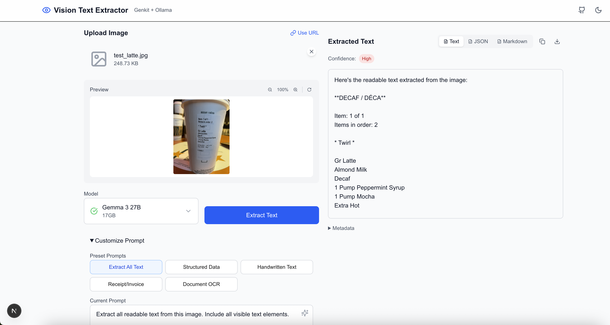

# Vision Text Extractor - Genkit + Ollama + Next.js

A sample web application for extracting text from images using Google Genkit and vision models served by Ollama. This project demonstrates how to integrate these technologies to build AI applications with local language models, optimized for developer laptops.



## Features

- 🖼️ **Multiple Input Methods**: Upload images via drag-and-drop, file selection, URL, or paste from clipboard
- 🤖 **Multiple Vision Models**: Support for Gemma 3 (4B, 12B, 27B), LLaVA, and other vision models available through Ollama
- 🎨 **Modern UI**: Compact layout with side-by-side input/output, dark mode support
- ⚡ **Real-time Streaming**: See results as they're generated with live updates
- 🔧 **Customizable Prompts**: Pre-built templates for common use cases and custom prompt support
- 📊 **Multiple Output Formats**: View results as text, JSON, or markdown
- 💾 **Export Options**: Download or copy extracted text with one click
- 🔍 **Compact Image Preview**: Zoom and rotate images without excessive scrolling
- 📌 **Sticky Results Panel**: Results stay visible while you adjust settings


## Prerequisites

- Node.js 18.x or later
- [Ollama](https://ollama.com) installed and running
- At least one vision-capable model installed (e.g., `gemma3:4b`)

### Installing Vision Models

```bash
# Install recommended Gemma 3 vision models (default)
ollama pull gemma3:4b      # Fast, good quality, 3.3GB (recommended)
ollama pull gemma3:12b     # Better quality, 8.1GB
ollama pull gemma3:27b     # Best quality, 17GB

# Alternative LLaVA models
ollama pull llava:7b       # Fast alternative, 4.1GB
ollama pull llava:13b      # Better LLaVA model, 7.3GB
```

## Installation

1. Clone this repository:
```bash
git clone <your-repo-url>
cd genkit-vision-nextjs
```

2. Install dependencies:
```bash
npm install
```

3. Start the development server:
```bash
npm run dev
```

4. Open [http://localhost:3000](http://localhost:3000) in your browser

## Project Structure

```
genkit-vision-nextjs/
├── app/
│   ├── api/
│   │   ├── extract-text/    # Genkit flow API endpoint
│   │   └── models/          # Model availability endpoint
│   ├── components/          # React components
│   │   ├── Header.tsx       # App header with theme toggle
│   │   ├── ImageUpload.tsx  # Image input component
│   │   ├── ImagePreview.tsx # Image viewer with controls
│   │   ├── ModelSelector.tsx # Model selection dropdown
│   │   ├── PromptInput.tsx  # Prompt customization
│   │   └── ExtractionResults.tsx # Results display
│   ├── hooks/              # Custom React hooks
│   └── page.tsx           # Main application page
├── lib/
│   ├── genkit/
│   │   ├── config.ts      # Genkit and model configurations
│   │   └── flows.ts       # Text extraction flow
│   └── utils.ts           # Utility functions
└── public/                # Static assets
```

## How It Works

### Genkit Integration

This app uses Google Genkit for AI orchestration with flows running on Next.js API routes:

```typescript
// lib/genkit/flows.ts
export const extractTextFromImage = ai.defineFlow({
  name: 'extractTextFromImage',
  inputSchema: imageExtractionInputSchema,
  outputSchema: imageExtractionOutputSchema,
  streamSchema: z.string(),
}, async (input, { sendChunk }) => {
  // Call Ollama API directly for better control
});
```

### API Routes

The Genkit flow is exposed as a Next.js API route:

```typescript
// app/api/extract-text/route.ts
import { extractTextFromImage } from '@/lib/genkit/flows';
import { appRoute } from '@genkit-ai/app-server';

export const POST = appRoute(extractTextFromImage);
```

### Frontend Integration

The React frontend consumes the API with streaming support:

```typescript
const response = await fetch('/api/extract-text', {
  method: 'POST',
  body: JSON.stringify({
    model: selectedModel,
    imageBase64: base64Image,
    prompt: extractionPrompt,
  }),
});

// Handle streaming response
const reader = response.body?.getReader();
// ... process chunks
```

## Configuration

### Environment Variables

Create a `.env.local` file:

```env
# Ollama API endpoint (optional, defaults to http://localhost:11434)
OLLAMA_API_URL=http://localhost:11434
```

### Model Configuration

Models are configured in `lib/genkit/config.ts`:

```typescript
export const MODEL_INFO = {
  'gemma3:4b': {
    name: 'Gemma 3 4B',
    description: 'Latest Google model with 128K context window',
    size: '3.3GB',
  },
  'gemma3:12b': {
    name: 'Gemma 3 12B',
    description: 'Better accuracy for complex documents',
    size: '8.1GB',
  },
  'gemma3:27b': {
    name: 'Gemma 3 27B',
    description: 'Highest accuracy for challenging layouts',
    size: '17GB',
  },
  // ... more models
};
```

## Usage

1. **Upload an Image**: Drag and drop, select a file, paste from clipboard, or provide a URL
2. **Select a Model**: Choose from available vision models (green checkmark indicates installed models)
3. **Customize the Prompt**: Use preset prompts or create your own
4. **Extract Text**: Click the button to start extraction
5. **View Results**: See extracted text with streaming updates
6. **Export**: Copy to clipboard or download as text/JSON

## Development

For the best development experience, we recommend running the Next.js frontend and the Genkit runtime in separate terminal sessions. This allows you to see logs from both processes independently and ensures the Genkit Developer UI functions correctly.

### Running the Development Environment

1.  **Start the Genkit Runtime:**

    Open a terminal and run the following command to start the Genkit runtime with hot-reloading. This will also launch the Genkit Developer UI.

    ```bash
    npm run genkit:watch
    ```

    The Genkit Developer UI will be available at `http://localhost:4000`.

2.  **Start the Frontend Application:**

    In a second terminal, run the following command to start the Next.js development server.

    ```bash
    npm run dev
    ```

    Your application will be available at `http://localhost:9002`.

**Note:** It is important to run the Genkit runtime (`genkit start`) separately from the frontend development server (`npm run dev`). Attempting to run them together with a command like `genkit start -- npm run dev` can lead to connection issues with the Genkit Developer UI, as the Next.js server runs in its own process and may not expose the necessary hooks for the UI to connect to the runtime.

### Creating a Standalone Build

To create a standalone build of the application, run the following commands:

```bash
npm run build
npm start
```

## Troubleshooting

### Ollama Connection Issues

If the app can't connect to Ollama:

1. Ensure Ollama is running: `ollama serve`
2. Check the API endpoint in your environment variables
3. Verify models are installed: `ollama list`

### Model Not Available

If a model shows as unavailable:

1. Install it with Ollama: `ollama pull model-name`
2. Refresh the page to update model availability

### Image Processing Errors

- Ensure images are under 10MB
- Supported formats: PNG, JPG, JPEG, GIF, WebP
- For URLs, ensure CORS is enabled on the image server

## Contributing

This project is provided as-is, and I do not plan to accept pull requests. Please feel free to fork the repository and make any changes you'd like.

## License

This project is licensed under the MIT License - see the [LICENSE](LICENSE) file for details.

## Disclaimer

This software is provided "as is", without warranty of any kind, express or implied, including but not limited to the warranties of merchantability, fitness for a particular purpose and noninfringement. In no event shall the authors or copyright holders be liable for any claim, damages or other liability, whether in an action of contract, tort or otherwise, arising from, out of or in connection with the software or the use or other dealings in the software.

## Acknowledgments

- [Google Genkit](https://genkit.dev) for AI orchestration
- [Ollama](https://ollama.com) for local model serving
- [Next.js](https://nextjs.org) for the web framework
- [Tailwind CSS](https://tailwindcss.com) for styling